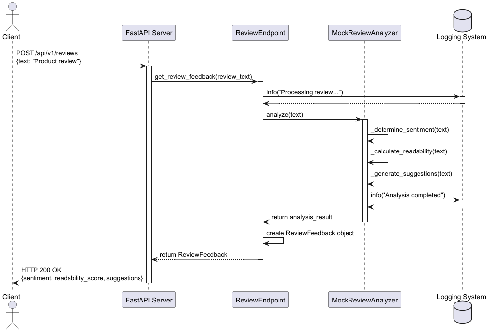

# Review Feedback API

A FastAPI service that leverages AI models to analyze product reviews and provide automated feedback on sentiment, readability, and content quality. This service helps businesses and content creators improve their review management process through data-driven insights.


## 🌟 Features

- **Sentiment Analysis**: Identifies the emotional tone of reviews as positive, negative, or neutral based on key phrase detection and contextual understanding
- **Readability Scoring**: Calculates text complexity using metrics like words per sentence, syllable count, and text length to assess clarity and comprehension level
- **Improvement Suggestions**: Provides automated recommendations for enhancing review quality, including detail level, formatting, and tone adjustments
- **API Documentation**: Interactive API documentation with Swagger UI and ReDoc

## 📋 Requirements

- Python 3.12+
- FastAPI
- Docker (optional)

## 🚀 Quick Start

### Clone the Repository

```bash
git clone https://github.com/ArcSalazar/Review_feedback_api.git
cd Review_feedback_api
```

### Using Docker (Recommended)

```bash
docker compose up --build
```

The API will be available at `http://localhost:8000`.

### Local Development

1. Create and activate a virtual environment:
```bash
python -m venv venv
source venv/bin/activate  # On Windows: venv\Scripts\activate
```

2. Install dependencies:
```bash
pip install -r requirements.txt
```

3. Start the server:
```bash
python -m app.main
```

The API will be available at `http://localhost:8000`.

## Adding new models
To add a new model to the system, you need to follow two main steps:

### 1. Interface Implementation
First, create your new analyzer class that implements the `ReviewAnalyzerInterface`. This ensures your new model follows the same contract as other analyzers in the system. The interface requires implementing the `analyze()` method that takes a text string and returns a dictionary with the analysis results. Your implementation should handle the specific logic for sentiment analysis, readability scoring, and generating suggestions according to your model's capabilities.

### 2. Dependency Injection Update
After implementing your analyzer, modify the dependency injection system by updating the `get_review_analyzer()` function in `dependencies.py`. Add logic to select between different analyzer implementations based on configuration (like environment variables or settings). This allows the system to switch between different analyzer implementations without changing the rest of the application code. The dependency injection ensures loose coupling between components and makes testing easier by allowing mock implementations to be injected.

These changes maintain the system's modularity while allowing new analysis models to be added with minimal impact on existing code.

## 📖 API Documentation

- **Swagger UI**: `http://localhost:8000/docs`

## 📝 API Usage Examples

```bash
curl -X POST "http://localhost:8000/api/v1/analyze" \
     -H "Content-Type: application/json" \
     -d '{"text": "This product exceeded my expectations. The quality is outstanding and customer service was very helpful when I had questions."}'
```

Example Response:
```json
{
  "sentiment": {
    "score": 0.89,
    "label": "positive",
    "key_phrases": ["exceeded expectations", "outstanding", "very helpful"]
  },
  "readability": {
    "score": 72.5,
    "grade_level": "7th grade",
    "stats": {
      "word_count": 21,
      "sentence_count": 2,
      "avg_words_per_sentence": 10.5
    }
  },
  "quality_assessment": {
    "score": 0.85,
    "strengths": ["specific details", "multiple aspects covered"],
    "improvement_suggestions": ["Consider adding more details about specific product features"]
  }
}
```

## API sequence diagram


## 🧪 Running Tests

```bash
# Run all tests
tox
```

## 🔄 Development Workflow

1. Create a feature branch from `main`
2. Implement changes and add tests
3. Run tests and ensure all pass
4. Create a pull request for review
5. After approval, merge to `main`

## 🛠️ Technologies Used

- **FastAPI**: High-performance web framework for building APIs
- **Pydantic**: Data validation and settings management
- **Docker**: Containerization for consistent deployment
- **Pytest**: Testing framework

## 👥 Contributing

Contributions are welcome! Please feel free to submit a Pull Request.

1. Fork the repository
2. Create your feature branch (`git checkout -b feature/amazing-feature`)
3. Commit your changes (`git commit -m 'Add some amazing feature'`)
4. Push to the branch (`git push origin feature/amazing-feature`)
5. Open a Pull Request

## 💡 Development Notes

This project was developed using AI-assisted tools:
- ChatGPT for project planning and base architecture
- JetBrains AI with Claude 3.5 Sonnet for coding and documentation assistance (around 30% improvement speed)
- JetBrains AI with Claude 3.5 Sonnet for plantUML diagram
- Claude Sonnet for the Readme.md
- AI usage evidence in [evidence_IA_usage](evidence_IA_usage)


## 📄 License

This project is licensed under the MIT License - see the LICENSE file for details.

## 📞 Contact

For questions or support, please open an issue on the GitHub repository.

---

Made with ❤️ by ArcSalazar